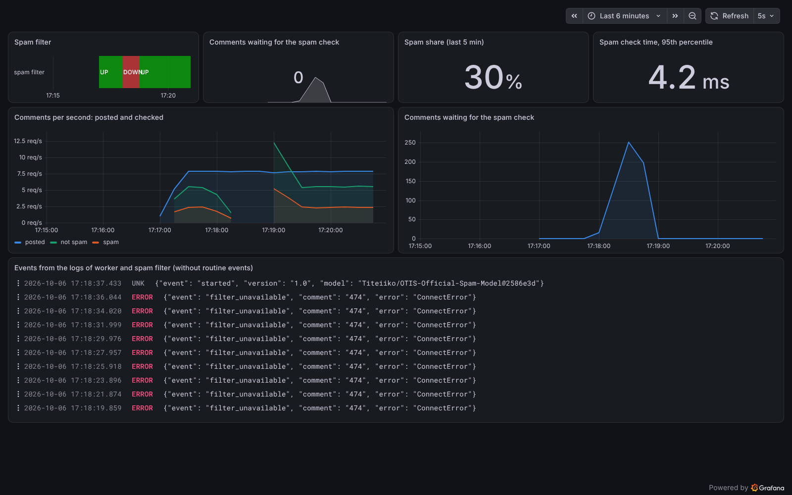

# 05 · Monitoring: metrics, alerts, and logs

The blog system from [02](../02-compose/) runs in production. The operators must know whether
it works, and they must find out about problems before the readers do. This project adds
monitoring to the same system: metrics, alerts, central logs, and a dashboard.

**Problem.** In 02, the blog stays available when the spam filter is down, but then new
comments silently wait in the queue. Nobody notices until readers complain. The information
is there (the worker logs each failure), but it is spread over many containers and nobody
reads it.

**Idea.** Observability in three steps:

1. **Produce telemetry.** Each service counts what it does and measures how long it takes
   (metrics on `/metrics`), and writes one JSON log line per event.
2. **Collect it in one place.** Prometheus pulls the metrics from each service every few
   seconds; Alloy reads the logs of all containers and sends them to Loki.
3. **Analyze it.** Alert rules check the metrics all the time; a Grafana dashboard shows
   metrics and logs together.

All configuration (scrape targets, alert rules, data sources, the dashboard) is in files in
this folder, so it is versioned with the code.

The spam filter produces its metrics with a few lines (`../01-container/spamfilter/app.py`):

```python
CHECKED = Counter("spamfilter_comments_total", "Checked comments", ["result"])
LATENCY = Histogram("spamfilter_inference_seconds", "Model inference time", buckets=[...])
...
LATENCY.observe(elapsed)
CHECKED.labels(result="spam" if spam else "ham").inc()
```

An alert rule is a query with a threshold and a duration (`prometheus/alerts.yml`):

```yaml
- alert: CommentsWaiting
  expr: blog_comments_waiting > 20
  for: 30s
  annotations:
    summary: "{{ $value }} comments wait for the spam check."
```

## What the code shows

`demo.sh` (output in [`transcript.txt`](transcript.txt)) sends 8 comments per second for
4 minutes and stops the spam filter for less than a minute:

1. Normal operation: Prometheus measures 7.8 comments per second, about 30% spam, and a few
   milliseconds for 95% of the spam checks. No alerts.
2. The spam filter stops. `SpamFilterDown` fires after about 35 s, `CommentsWaiting` after
   about 40 s (the rules wait 30 s, to not alert on short problems). About 300 comments wait.
   Loki has the worker's `filter_unavailable` log lines from the container logs.
3. The spam filter starts again. The worker checks the waiting comments, and all alerts are
   resolved within about 20 s.
4. The dashboard ([`dashboard.png`](dashboard.png)) shows the outage: the DOWN period, the
   gap in the checked comments, the peak of waiting comments, and the log events.



The rule `UnusualSpamShare` (more than 60% spam) and `SlowSpamFilter` (95th percentile above
100 ms) do not fire in the demo; they watch the model and its performance, not only the
infrastructure.

## Tools

- [Prometheus](https://prometheus.io): collects metrics as time series by pulling them from
  the services, and evaluates alert rules. Here: scrapes the blog and the spam filter every
  5 s; four alert rules.
- [Prometheus Python client](https://prometheus.github.io/client_python/): counters, gauges,
  and histograms in Python code. Here: the metrics of the blog and the spam filter.
- [Grafana Alloy](https://grafana.com/docs/alloy/): a collector for telemetry. Here: finds the
  containers of this system through the Docker socket and sends their logs to Loki.
- [Loki](https://grafana.com/docs/loki/): stores logs and makes them searchable with labels and
  LogQL. Here: the logs of all containers, with the label `service`.
- [Grafana](https://grafana.com/docs/grafana/): dashboards for metrics and logs. Here: the
  dashboard in `grafana/dashboards/blog.json`, loaded at start (provisioning).
- [Playwright](https://playwright.dev/python/): browser automation. Here: the screenshot of
  the dashboard (`screenshot.py`).

## Run

With [Docker](https://docs.docker.com/get-docker/), [uv](https://docs.astral.sh/uv/), and
`jq`:

```sh
./demo.sh                    # about 6 minutes; also writes dashboard.png
docker compose up -d --build # only start the system
```

Then open Grafana at <http://localhost:3000> and Prometheus at <http://localhost:9090>, post
comments with `uv run ../traffic/send_traffic.py --target blog --url http://localhost:8080
--duration 300 --rate 5`, and stop and start the spam filter with
`docker compose stop spamfilter` and `docker compose start spamfilter`. Stop everything with
`docker compose down -v`.
