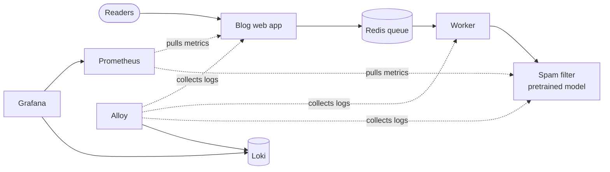

# Planning for Operations: code examples

Small, runnable examples for the lecture *Planning for Operations* of the course
[Machine Learning in Production](https://mlip-cmu.github.io) (see also chapter
[Planning for Operations](https://mlip-cmu.github.io/book/13-planning-for-operations.html) of
the book). Each folder shows one operations topic with current tools.

## Case study: a blogging platform with a spam filter

Readers post comments on blog posts. A spam filter decides whether each comment is spam. The
spam filter is a small service with a pretrained model from Hugging Face
([OTIS](https://huggingface.co/Titeiiko/OTIS-Official-Spam-Model), 4M parameters); we do not
train a model. The blog puts new comments into a queue, and a worker sends them to the spam
filter, so that the blog keeps working when the spam filter is down.



The same spam filter image runs in all projects: alone (01), as part of the blog system
(02, 05), on servers configured with Ansible (03), and on Kubernetes (04).

## Projects

| Lecture topic (slides) | Project | Tools |
|---|---|---|
| Containers (33–34); release problems (15–16) | [01-container](01-container/): the spam filter service and its image | Docker, uv, FastAPI, ONNX Runtime |
| Virtualize the infrastructure; operations: avoid downtime (8) | [02-compose](02-compose/): the blog system on one machine; the blog keeps working when the spam filter is down | Docker Compose, Redis |
| Configuration management (35–37) | [03-ansible](03-ansible/): configure four servers; idempotence, drift, secrets | Ansible, Ansible Vault |
| Container orchestration (38–40) | [04-kubernetes](04-kubernetes/): replicas, self-healing, rolling update, rollback, autoscaling | minikube, kubectl |
| Monitoring (41–42) | [05-monitoring](05-monitoring/): metrics, alerts, logs, and a dashboard during an outage | Prometheus, Loki, Alloy, Grafana |

## How to read and run

Each folder has a short README, the code, and a `transcript.txt` with the output of its
`demo.sh`. You can read everything on GitHub without running anything.

To run the demos, you need [Docker](https://docs.docker.com/get-docker/),
[uv](https://docs.astral.sh/uv/), and `jq`; for 04 also
[minikube](https://minikube.sigs.k8s.io/docs/start/) and `kubectl`.

```sh
./run_all.sh                 # all demos (writes the transcripts again)
./run_all.sh 02-compose      # one demo
```

[`traffic/send_traffic.py`](traffic/send_traffic.py) sends synthetic comments (30% spam) to the
spam filter or to the blog, for example
`uv run traffic/send_traffic.py --target blog --url http://localhost:8080 --duration 60 --rate 5`.

GitHub Actions runs every demo on each push ([`.github/workflows/ci.yml`](.github/workflows/ci.yml)).
